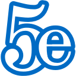

## Favicon update - 1.114.2 (probably)
Website favicons have been subtly redone by jpcranford (aka ldsmadman), based on the original logo by Fantom and Cyanomouss.

Here's a quick breakdown of what the new icons look like:

&nbsp;&nbsp;&nbsp;&nbsp;&nbsp;

*New favicon and preview*


*App icon*


*Safari Pinned Tab*


*MacBook Touch Bar Bookmark*

_**Not pictured, but updated:** Android splash screen, Windows Start Menu tiles, standalone app mode_

SVG designs were completed within Illustrator, and final sizes generated with Sketch. All source files have been included in a ZIP file [here](./favicon_source_files.zip), with the changes detailed below for the curious.

### New HTML code
This is the code that should now be in every page's `<head>` section.

```html
<!-- Favicons -->
<link rel="icon" type="image/svg+xml" href="favicon.svg">
<link rel="icon" type="image/png" sizes="256x256" href="favicon-256x256.png">
<link rel="icon" type="image/png" sizes="144x144" href="favicon-144x144.png">
<link rel="icon" type="image/png" sizes="128x128" href="favicon-128x128.png">
<link rel="icon" type="image/png" sizes="64x64" href="favicon-64x64.png">
<link rel="icon" type="image/png" sizes="48x48" href="favicon-48x48.png">
<link rel="icon" type="image/png" sizes="32x32" href="favicon-32x32.png">
<link rel="icon" type="image/png" sizes="16x16" href="favicon-16x16.png">

<!-- Chrome Web App Icons -->
<link rel="manifest" href="manifest.webmanifest">
<meta name="application-name" content="5E">
<meta name="theme-color" content="#006bc4">

<!-- Windows Start Menu tiles -->
<meta name="msapplication-config" content="browserconfig.xml"/>
<meta name="msapplication-TileColor" content="#006bc4">

<!-- Apple Touch Icons -->
<link rel="apple-touch-icon" sizes="180x180" href="apple-touch-icon-180x180.png">
<link rel="apple-touch-icon" sizes="360x360" href="apple-touch-icon-360x360.png">
<link rel="apple-touch-icon" sizes="167x167" href="apple-touch-icon-167x167.png">
<link rel="apple-touch-icon" sizes="152x152" href="apple-touch-icon-152x152.png">
<link rel="apple-touch-icon" sizes="120x120" href="apple-touch-icon-120x120.png">
<meta name="apple-mobile-web-app-title" content="5E">

<!-- macOS Safari Pinned Tab and Touch Bar -->
<link rel="mask-icon" href="safari-pinned-tab.svg" color="#006bc4">
```

### More changes
- **Favicon:** The stroke color has been changed to match the app icon. This has the added benefit of making it easier to see while in dark mode.
- **App icon:** The text has been resized within the app icon to give more spacing around edge. (Apple's "official" app icon design grid came in handy here.) Also, a *slight* gradient was applied to give it some almost-imperceptible pop.
- **Goodbye, pirate hat:** The icon with the pirate hat has been replaced. It was cheeky, but definitely not the impression we want to give off. <!-- TODO: Delete the /icon folder, wherever it is, since it's not used anymore -->
- **Android splash screen:** When launching it from the home screen on Android, 5E now gets a fancy splash screen.
- **Better standalone mode:** After adding 5E to your device's home screen (or installing it in your browser as an app), it now behaves like its own app, including showing up in your app switcher as "5E." It did this before, but now it should behave a little nicer. Depending on your platform, it might even show a back button now.
